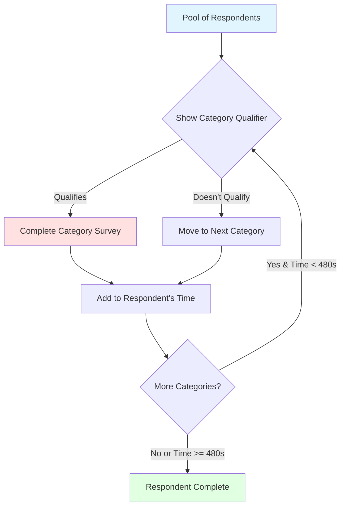
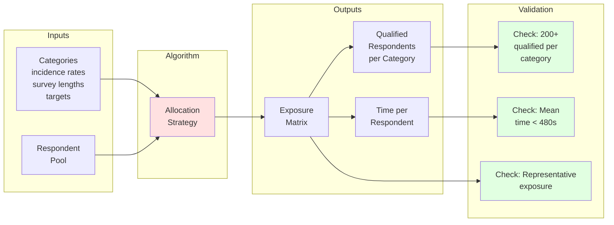

# Survey Allocation Problem Formulation

## Problem Overview

We need to allocate categories to respondents to minimize the total number of respondents surveyed, while ensuring:
- Each category gets at least 200 qualified respondents
- The average respondent doesn't exceed 480 seconds of survey time
- Everyone has a fair chance to see each category qualifier (demographic representativeness)

## High-Level Flow

## Key Concepts

### For Each Category
- **Incidence Rate**: Probability a respondent qualifies (e.g., 20% for honey buyers)
- **Survey Length**: Time in seconds for qualified respondents to complete the category survey
- **Target**: Need 200 qualified respondents for each category

### For Each Respondent
- **Time Budget**: Maximum 480 seconds total
- **Category Exposures**: Which category qualifiers they see
- **Qualifications**: Which categories they qualify for (random, based on incidence rate)
- **Completions**: Which category surveys they complete (only if qualified)

## The Optimization Challenge

**Minimize**: Total number of respondents surveyed

### What We Must Respect (Constraints)

#### 1. Qualified Respondent Target

$$
r_c \times N \geq 200 \quad \forall c \in C
$$

Where:
- $C$ is the set of all categories
- $r_c$ is the incidence rate (probability of qualification) for category $c$
- $N$ is the total number of respondents

#### 2. Time Budget
The expected survey time for a respondent must be $\leq$ 480 seconds:

$$
E\left[\sum_{c \in C_i} l_c \times r_c\right] \leq 480 \text{ seconds (8 minutes)}
$$

Where:
- $i$ indexes individual respondents $(i = 1, 2, ..., N)$
- $C_i$ is the set of categories that respondent $i$ is exposed to
- $l_c$ is the category length in seconds
- $r_c$ is the incidence rate (probability of qualification) for category $c$

#### 3. Demographic Representativeness

Each category's exposure (# of people who are EXPOSED to the category qualifier not necessarily qualified) must be demographically representative of the national population.

**Modelling this constraint**:

I model this constraint looking only at gender and age demographics separately (not their joint distribution, and we don't model regional demographics).

For each category, the proportion of the population exposed should match (within ±2%) the US population distribution for:
- Each age segment separately (e.g., 18-64, 65+)
- Each gender separately (e.g., Female, Male)

## Problem Structure

## Simplifying Assumptions

Based on the problem statement:

1. **Qualifier time = 0 seconds**: Category qualifiers consume no survey time (stated in problem)
2. **Completion = 100%**: If a respondent qualifies for a category, they complete the full survey
3. **Demographics**: We only model gender and age demographics separately (not their joint distribution, and we don't model regional demographics).

## Success Metrics

- **Primary**: Total respondents surveyed (lower is better)
- **Gap to bounds**: How close we get to the theoretical minimum (calculated in `src/bounds_calculation.py`)
- **Constraint satisfaction**:
  - All categories get 200+ qualified respondents
  - Mean respondent time < 480s
  - Demographic distribution of exposures matches national population (within ±2%)
